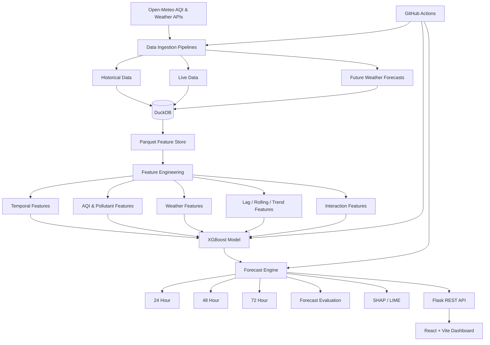

# 🇵🇰 PEARLSAQI — Pakistan AQI Prediction & Forecasting Platform

<p align="center">
  <strong>Predicting Air Quality Across Pakistan with Machine Learning, Forecasting & Explainable AI</strong>
</p>

<p align="center">
  
  
  
  
  
  
  
  
</p>

---

## 🌫️ What is PEARLSAQI?

**PEARLSAQI** is an end-to-end Air Quality Index (AQI) prediction and forecasting platform built for major cities across Pakistan.

The system transforms environmental observations into actionable **24-hour, 48-hour, and 72-hour AQI forecasts** through a complete machine-learning pipeline:

```text
Environmental Data
       ↓
Data Ingestion
       ↓
DuckDB + Parquet Storage
       ↓
Feature Engineering
       ↓
XGBoost Prediction
       ↓
24h / 48h / 72h Forecasting
       ↓
SHAP / LIME Explainability
       ↓
Flask REST API
       ↓
React + Vite Dashboard
```

Rather than being only a trained ML model, PEARLSAQI is designed as a complete application covering **data engineering, machine learning, forecasting, explainability, monitoring, visualization, and automation**.

---

## 🇵🇰 Cities Covered

PEARLSAQI currently supports **12 cities across Pakistan**:

| # | City | # | City |
|---|---|---|---|
| 01 | Karachi | 07 | Multan |
| 02 | Lahore | 08 | Quetta |
| 03 | Islamabad | 09 | Hyderabad |
| 04 | Peshawar | 10 | Gujranwala |
| 05 | Rawalpindi | 11 | Sialkot |
| 06 | Faisalabad | 12 | Bahawalpur |

The multi-city design allows the same forecasting platform to provide city-specific AQI information while maintaining a shared feature and prediction architecture.

---

# 📚 Table of Contents

- [What is PEARLSAQI?](#-what-is-pearlsaqi)
- [Cities Covered](#-cities-covered)
- [Project Objectives](#-project-objectives)
- [Core Capabilities](#-core-capabilities)
- [System Architecture](#-system-architecture)
- [Data Pipeline](#-data-pipeline)
- [Data Sources](#-data-sources)
- [Data Storage](#-data-storage)
- [Feature Engineering](#-feature-engineering)
- [Machine Learning](#-machine-learning)
- [Model Evaluation](#-model-evaluation)
- [Forecasting Strategy](#-forecasting-strategy)
- [Forecast Evaluation](#-forecast-evaluation)
- [Explainable AI](#-explainable-ai)
- [Backend & API](#-backend--api)
- [Frontend Dashboard](#-frontend-dashboard)
- [Automation](#-automation)
- [Monitoring](#-monitoring)
- [Project Structure](#-project-structure)
- [Technology Stack](#-technology-stack)
- [Running Locally](#-running-locally)
- [Docker](#-docker)
- [Validation & Testing](#-validation--testing)
- [Design Decisions](#-design-decisions)
- [Limitations](#-limitations)
- [Future Improvements](#-future-improvements)
- [Conclusion](#-conclusion)

---

# 🎯 Project Objectives

The project was designed around the following objectives:

1. Collect and maintain AQI and environmental data for major Pakistani cities.
2. Build a reproducible feature-engineering pipeline for time-series AQI prediction.
3. Develop a machine-learning model capable of predicting future AQI.
4. Produce separate **24-hour, 48-hour, and 72-hour** forecasts.
5. Incorporate future weather information into the forecasting process.
6. Provide model explanations using SHAP and LIME.
7. Expose predictions through a backend API.
8. Present results through an interactive web dashboard.
9. Monitor forecast performance against actual AQI observations.
10. Automate recurring data and operational workflows.

---

# ✨ Core Capabilities

### 📡 Environmental Data
- AQI data ingestion
- Weather observations
- Future weather forecasts
- Pollutant information
- Historical data processing

### 🧠 Machine Learning
- V4 feature engineering
- ~108 predictive features
- XGBoost regression
- Chronological/time-aware validation
- Model artifact storage
- Model versioning

### 🔮 Forecasting
- 24-hour AQI forecast
- 48-hour AQI forecast
- 72-hour AQI forecast
- Recursive multi-step forecasting
- Future-weather-aware inference
- Historical forecast replay/evaluation

### 🔍 Explainability
- SHAP analysis
- LIME analysis
- Feature importance
- Local prediction contributions

### 🖥️ Application
- Flask REST backend
- React + Vite frontend
- Interactive Pakistan map
- City-level AQI cards
- Forecast charts
- Weather information
- Model metrics
- Explainability views
- AQI alerts

### ⚙️ Operations
- GitHub Actions automation
- DuckDB database
- Parquet feature store
- Docker support
- Forecast monitoring
- Error analysis

---

# 🏗️ System Architecture



---

# 🔄 Data Pipeline

PEARLSAQI follows a complete environmental-data-to-forecast workflow.

## 1. Data Ingestion

The ingestion layer retrieves environmental information from **Open-Meteo**, including air-quality and weather variables.

The system works with variables such as:

- AQI
- PM2.5-related pollution information
- Temperature
- Humidity
- Precipitation
- Wind speed
- Other available environmental variables

---

## 2. Historical Data

Historical observations are processed into a consistent structure before being used by the feature pipeline.

Historical data supports:

- Model training
- Feature generation
- Backtesting
- Forecast evaluation
- Error analysis

---

## 3. Live Data

The live pipeline updates the latest available environmental information and makes it available to the forecasting system.

---

## 4. Future Weather

Future weather information is stored separately in:

```text
weather_forecasts
```

This separation is important because historical observations and future forecast vintages serve different purposes.

For historical replay, the forecasting system constrains weather selection by the forecast origin so that information issued after the simulated forecast time is not accidentally introduced.

---

## 5. Feature Generation

The latest environmental context is transformed into the model's ordered feature representation.

---

## 6. Prediction

The trained XGBoost model produces AQI predictions for the requested forecast horizons.

---

## 7. Evaluation

Predictions are stored alongside actual AQI observations when those observations become available.

This allows the system to measure:

- Error
- Absolute error
- Forecast accuracy
- Horizon-specific performance

---

# 🌦️ Data Sources

## Open-Meteo

Open-Meteo is the current primary external environmental data source.

It is used for:

- Air-quality data
- AQI-related variables
- Weather observations
- Temperature
- Humidity
- Precipitation
- Wind speed
- Weather forecasts
- Historical/forecast weather workflows

Using a consistent source simplifies the data pipeline and makes the project easier to reproduce.

---

# 🗄️ Data Storage

## DuckDB

The main analytical database is:

```text
database/aqi.duckdb
```

DuckDB was selected because it provides:

- Fast analytical SQL
- Local deployment
- Simple Python integration
- No database server requirement
- Convenient development and testing
- Efficient analytical queries

The database stores core environmental and forecasting information.

---

## Parquet Feature Store

The project uses Parquet as its local feature-store layer:

```text
data/feature_store/
├── historical_features.parquet
└── live_features.parquet
```

Parquet provides an efficient columnar format for:

- Feature storage
- Model inference
- Reproducibility
- Local analysis
- Efficient data loading

The final architecture does **not** depend on Hopsworks or n8n.

---

# 🧬 Feature Engineering

Feature engineering is one of the most important components of PEARLSAQI.

The V4 feature set contains approximately **108 predictive features** combining temporal, pollution, weather, statistical, and interaction information.

## Feature Families

| Feature Family | Examples |
|---|---|
| AQI | Current AQI, lags, changes, rolling statistics, trends |
| Pollutants | Pollutant values, changes, rolling statistics |
| Weather | Temperature, humidity, precipitation, wind speed |
| Temporal | Month, day, cyclical features, seasonal patterns |
| Rolling | Rolling mean, standard deviation, minimum, maximum |
| Trends | Differences, changes, trend/momentum features |
| Ratios | Pollution ratios and interaction features |
| City History | Historical city-level statistics |
| Regimes | AQI regime/category-related features |

### AQI Temporal Features

The model uses historical AQI context through:

- Lag features
- AQI changes
- Rolling statistics
- Trends
- Regime information
- City history

### Weather Features

Weather information includes:

- Temperature
- Humidity
- Precipitation
- Wind speed
- Weather changes
- Rolling weather statistics

### Pollution Features

Pollution-related features include:

- Pollutant measurements
- Pollutant lags
- Pollutant changes
- Rolling pollutant statistics
- Pollution interactions
- Pollution ratios
- Pollution sum

### Calendar Features

Calendar information helps the model learn recurring patterns:

- Month
- Day
- Day-of-week patterns
- Cyclical time representations
- Seasonal effects

---

## ⭐ Additional V4 Feature

One of the important engineered features evaluated during V4 development was:

```text
pm25_pollution_ratio
```

This feature captures the relationship between PM2.5 pollution and the broader pollution context rather than relying only on absolute pollutant values.

---

# 🤖 Machine Learning

## XGBoost

XGBoost is the primary production model family used by the current PEARLSAQI forecasting architecture.

AQI forecasting is a highly non-linear tabular problem involving:

- Historical dependencies
- Weather interactions
- Pollution relationships
- Temporal patterns
- City-specific behavior
- Rolling statistics

XGBoost is well suited to these engineered tabular relationships.

---

## Representative Configuration

The V4 training configuration includes:

```python
XGBRegressor(
    n_estimators=500,
    learning_rate=0.05,
    max_depth=6,
    min_child_weight=3,
    subsample=0.8,
    colsample_bytree=0.8,
    objective="reg:squarederror",
    eval_metric="rmse",
    random_state=42,
    n_jobs=-1
)
```

The fixed random seed improves reproducibility.

---

# 📊 Model Evaluation

A V4 candidate model using approximately **108 predictive features** achieved the following evaluation results during development:

| Metric | Result |
|---|---:|
| **RMSE** | **≈ 13.37** |
| **MAE** | **≈ 8.80** |
| **R²** | **≈ 0.913** |

These are candidate/evaluation results for the V4 model development process and should be interpreted with respect to the validation dataset and evaluation procedure used.

Candidate artifacts include:

```text
models/
└── benchmark/
    └── v4/
        └── final_candidate/
            ├── xgboost_v4_final_108.pkl
            └── feature_columns.json
```

---

# 🔮 Forecasting Strategy

PEARLSAQI provides three primary user-facing horizons:

```text
24 Hours
48 Hours
72 Hours
```

The current forecasting engine is:

```text
src/ml/forecast_engine_v9.py
```

## Recursive Multi-Step Forecasting

The engine maintains a working prediction state and generates future predictions recursively.

Conceptually:

```text
Current Observation
       │
       ▼
   ┌────────┐
   │ Model  │
   └───┬────┘
       │
       ├──────────────► 24h AQI
       │
       ▼
 Updated Forecast State
       │
       ▼
   ┌────────┐
   │ Model  │
   └───┬────┘
       │
       ├──────────────► 48h AQI
       │
       ▼
 Updated Forecast State
       │
       ▼
   ┌────────┐
   │ Model  │
   └───┬────┘
       │
       └──────────────► 72h AQI
```

A standard forecast run produces:

```text
12 cities × 3 horizons = 36 forecast rows
```

The user-facing output contains the three requested horizons without exposing an unnecessary bridge day.

---

# 🌤️ Future Weather Integration

Future weather is retrieved from the `weather_forecasts` table.

The forecast system uses:

```sql
SELECT temperature,
       humidity,
       precipitation,
       windspeed
FROM weather_forecasts
WHERE city_id = ?
  AND date = ?
  AND forecast_origin <= ?
ORDER BY forecast_origin DESC
LIMIT 1;
```

The forecast-origin constraint is especially important during historical replay because it prevents future forecast vintages from leaking into historical simulations.

---

# 📈 Forecast Evaluation

Forecasts are compared against the actual AQI for the corresponding forecast date.

The system stores:

```text
forecast_predictions
```

with information including:

| Field | Purpose |
|---|---|
| city_id | City identifier |
| city_name | City name |
| origin_date | Date forecast was generated |
| forecast_date | Date being predicted |
| horizon | Forecast horizon |
| predicted_aqi | Model prediction |
| actual_aqi | Observed AQI |
| error | Prediction error |
| absolute_error | Absolute prediction error |
| model_name | Model used |
| created_at | Record timestamp |

This structure enables horizon-specific backtesting and operational monitoring.

---

# 🔍 Explainable AI

A major goal of PEARLSAQI is to make predictions interpretable rather than treating the model as a black box.

## SHAP

SHAP can be used to analyze:

- Global feature importance
- Individual prediction contributions
- Positive/negative feature effects
- Model behavior

Example questions:

> Which features pushed the AQI prediction higher?

> Which environmental conditions reduced the prediction?

> Which features are most influential overall?

---

## LIME

LIME provides local explanations for individual predictions.

It complements SHAP by providing a local approximation of model behavior around a specific prediction.

---

## Explainability Architecture

```text
Forecast Request
      ↓
Model Prediction
      ↓
Explainability Layer
      ├── SHAP
      └── LIME
      ↓
Feature Contributions
      ↓
Dashboard
```

The system is designed so explainability failures do not invalidate an otherwise successful forecast.

---

# 🖥️ Backend & API

The backend is implemented with **Flask**.

Its responsibilities include:

- AQI data access
- City information
- Forecast retrieval
- Weather information
- Model information
- Explainability data
- Monitoring information
- Alert information

The backend separates data/ML logic from the frontend application.

---

# 🎨 Frontend Dashboard

The frontend is built with:

- React
- Vite
- Recharts
- React Leaflet
- Leaflet
- Lucide React

The dashboard is designed to make complex model output understandable to a normal user.

## Dashboard Components

### 🇵🇰 Pakistan Map

The interface visualizes supported cities geographically.

```text
Pakistan
 ├── Karachi
 ├── Lahore
 ├── Islamabad
 ├── Peshawar
 ├── Rawalpindi
 ├── Faisalabad
 ├── Multan
 ├── Quetta
 ├── Hyderabad
 ├── Gujranwala
 ├── Sialkot
 └── Bahawalpur
```

### AQI City Cards

Each city can display:

- Current AQI
- AQI category
- Weather
- Forecast values
- Trend information

### Forecast Visualization

The dashboard presents:

```text
24h ─────► Near-term forecast
48h ─────► Medium-term forecast
72h ─────► Longer forecast
```

### Explainability

Model explanations are surfaced through the dashboard so users can investigate why a prediction was made.

---

# ⚙️ Automation

GitHub Actions is the final automation layer used by the project.

Automation supports recurring operational tasks such as:

- AQI database updates
- Pipeline execution
- Forecast generation
- Model-related workflows
- Monitoring/evaluation operations

The final architecture does **not** rely on n8n.

---

# 📡 Monitoring

PEARLSAQI includes monitoring and evaluation components for:

- Forecast predictions
- Actual AQI
- Prediction error
- Absolute error
- Historical forecast performance
- Extreme residual analysis
- Forecast validation

This creates a feedback loop:

```text
Prediction
    ↓
Actual AQI arrives
    ↓
Prediction vs Actual
    ↓
Error calculation
    ↓
Monitoring
    ↓
Model evaluation
```

---

# 🚨 AQI Alerts

The platform includes AQI alert functionality intended to communicate potentially hazardous AQI conditions.

Alerts can be integrated with the forecasting/monitoring layer to make the platform more useful for practical environmental awareness.

---

# 📁 Project Structure

The repository is organized around separate data, ML, application, and operational responsibilities.

```text
aqi-predictor-v4/
│
├── backend/
│
├── frontend/
│   ├── public/
│   │   └── landmarks/
│   └── src/
│
├── data/
│   └── feature_store/
│       ├── historical_features.parquet
│       └── live_features.parquet
│
├── database/
│   └── aqi.duckdb
│
├── models/
│   └── benchmark/
│
├── scripts/
│   ├── data/
│   │   ├── download_historical_data.py
│   │   ├── download_weather_history.py
│   │   └── test_weather_download.py
│   │
│   ├── evaluation/
│   │   ├── compare_production_baseline.py
│   │   ├── evaluate_forecast_history.py
│   │   ├── extreme_residual_error_analysis.py
│   │   ├── verify_future_weather.py
│   │   └── verify_weather_forecasts.py
│   │
│   ├── maintenance/
│   │   ├── backfill.py
│   │   ├── cleanup_monitoring.py
│   │   ├── cleanup_weather_duplicates.py
│   │   ├── create_forecast_table.py
│   │   ├── create_monitoring_table.py
│   │   ├── run_daily_pipeline.bat
│   │   └── sync_features_to_database.py
│   │
│   └── inspect_*.py
│
├── src/
│   ├── database/
│   ├── ml/
│   │   └── forecast_engine_v9.py
│   └── pipelines/
│
├── public/
│   └── pakistan.geojson
│
├── docker-compose.yml
├── requirements.txt
└── README.md
```

---

# 🧰 Technology Stack

| Layer | Technology |
|---|---|
| Programming | Python |
| Machine Learning | XGBoost |
| Explainability | SHAP, LIME |
| Database | DuckDB |
| Feature Store | Apache Parquet |
| Environmental Data | Open-Meteo |
| Backend | Flask |
| Frontend | React |
| Frontend Tooling | Vite |
| Charts | Recharts |
| Maps | Leaflet / React Leaflet |
| Icons | Lucide React |
| Automation | GitHub Actions |
| Containerization | Docker |
| Data Processing | Pandas / NumPy |

---

# 🚀 Running Locally

## 1. Clone the repository

```bash
git clone https://github.com/VrdaRehman01/PEARLSAQI.git
cd PEARLSAQI
```

## 2. Create a Python environment

### Windows

```powershell
python -m venv .venv
.venv\Scripts\Activate.ps1
```

### Linux / macOS

```bash
python3 -m venv .venv
source .venv/bin/activate
```

## 3. Install Python dependencies

```bash
pip install -r requirements.txt
```

---

# 🖥️ Start the Backend

From the project root, activate the virtual environment and run the Flask backend using the project's configured backend entry point.

The backend is intended to run on:

```text
http://localhost:5000
```

---

# 🌐 Start the Frontend

Move into the frontend directory:

```powershell
cd frontend
```

Install dependencies:

```powershell
npm install
```

Start the development server:

```powershell
npm run dev
```

The Vite development server normally runs on:

```text
http://localhost:5173
```

---

# 🐳 Docker

The repository includes:

```text
docker-compose.yml
```

Docker provides a consistent environment for running the application and supporting services.

---

# 🧪 Validation & Testing

PEARLSAQI validates the system at multiple levels.

## Data Validation

- API response validation
- Missing data checks
- Duplicate detection
- Weather-data validation
- Historical data checks

## Feature Validation

- Feature count validation
- Feature-column consistency
- Missing-value checks
- Historical/live compatibility
- Feature-store validation

## Model Validation

- RMSE
- MAE
- R²
- Baseline comparisons
- Walk-forward evaluation
- Residual analysis

## Forecast Validation

- 24-hour forecast evaluation
- 48-hour forecast evaluation
- 72-hour forecast evaluation
- Actual-vs-predicted comparisons
- Historical replay
- Forecast-vintage leakage prevention

---

# 🧠 Design Decisions

## Why DuckDB?

DuckDB provides a lightweight analytical database without requiring a separate database server.

This makes the system:

- Easier to develop
- Easier to deploy
- Reproducible
- Efficient for analytical queries

---

## Why Parquet?

Parquet is a columnar format that works well for ML feature storage.

It provides:

- Efficient reads
- Compact storage
- Easy Python integration
- Reproducible feature datasets

---

## Why XGBoost?

AQI prediction depends on complex non-linear interactions between:

- Pollution
- Weather
- Historical AQI
- Seasonal patterns
- City-specific conditions

XGBoost is particularly effective for engineered tabular datasets with these characteristics.

---

## Why Multiple Forecast Horizons?

A single forecast horizon is not enough for practical AQI planning.

The system therefore provides:

```text
24h → immediate planning
48h → short-term planning
72h → extended planning
```

---

## Why Future Weather?

Weather influences air quality.

Future weather forecasts allow the prediction pipeline to incorporate expected environmental conditions rather than relying only on historical weather.

---

## Why Explainability?

A prediction is more useful when users can understand the factors influencing it.

SHAP and LIME provide an additional interpretability layer around the machine-learning model.

---

# 🔐 Reproducibility

The project emphasizes reproducibility through:

- Source-controlled code
- Explicit feature engineering
- Stored feature-column definitions
- Versioned model artifacts
- DuckDB storage
- Parquet feature storage
- Fixed random seeds where applicable
- Automated workflows
- Documented forecasting logic

---

# ⚠️ Limitations

The current system has several practical limitations:

1. Forecast accuracy depends on the quality and availability of external environmental data.
2. Future weather forecast errors can affect multi-day AQI predictions.
3. Recursive forecasting may accumulate errors at longer horizons.
4. AQI methodologies can differ between providers, so values should be compared using the same source and definition.
5. Model performance can vary across cities and pollution regimes.
6. A fresh clone may require model artifacts and local data to be generated before the full forecasting workflow can operate.
7. Local feature storage prioritizes reproducibility and simplicity but is not equivalent to a large distributed feature-store infrastructure.
8. The current project is designed around the Open-Meteo-based environmental data pipeline.

---

# 🚀 Future Improvements

Possible future development includes:

- City-specific model specialization
- Probabilistic AQI forecasting
- Prediction intervals
- Uncertainty estimation
- Improved long-horizon forecasting
- More extensive hyperparameter optimization
- Additional environmental data sources
- More advanced temporal neural architectures
- Automated drift detection
- More sophisticated model retraining policies
- Improved alert automation
- More extensive dashboard analytics
- Deployment to a managed cloud environment

---

# 📌 Project Status

PEARLSAQI currently represents a complete integrated prototype/production-oriented forecasting platform with:

```text
✅ 12 Pakistani cities
✅ Environmental data ingestion
✅ DuckDB analytical storage
✅ Parquet feature store
✅ V4 feature engineering
✅ ~108 predictive features
✅ XGBoost forecasting
✅ 24h / 48h / 72h forecasting
✅ Future weather integration
✅ Forecast evaluation
✅ SHAP / LIME explainability
✅ Flask backend
✅ React + Vite frontend
✅ Pakistan map visualization
✅ Monitoring
✅ AQI alerts
✅ GitHub Actions automation
✅ Docker support
```

---

# 🏁 Conclusion

PEARLSAQI brings together multiple disciplines into one end-to-end environmental intelligence platform:

```text
Data Engineering
       +
Time-Series Feature Engineering
       +
Machine Learning
       +
Multi-Horizon Forecasting
       +
Explainable AI
       +
Backend Engineering
       +
Frontend Development
       +
Monitoring & Automation
       =
PEARLSAQI
```

The platform is designed to move beyond a simple AQI prediction notebook and provide a practical system capable of collecting environmental data, generating engineered features, producing multi-horizon AQI forecasts, explaining model behavior, exposing predictions through an API, visualizing results through an interactive dashboard, and supporting ongoing monitoring.

Its current architecture uses **Open-Meteo, DuckDB, Parquet, XGBoost, SHAP/LIME, Flask, React/Vite, GitHub Actions, and Docker** to provide a reproducible and extensible foundation for AQI forecasting across Pakistan.

---

## 📜 License

This project is intended for academic, research, and development purposes.

See the repository for the applicable project/license terms.
